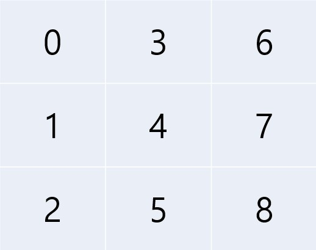

# CV_PA1


## 1. Neighborhood Matrix

* We have to calculate neighborhood matrix which is a collection of weights between each pixel and its neighbor pixels in the given image

* The number of neighboring pixels differs according to location of pixel; corner pixel is 3, edge pixel is 5, else is 8

* So -1 padding is applied around by the given image.

  ```python
  img = img.astype(np.int16)
  img = np.pad(img, (1,1),constant_values=-1)
  ```

* The indexing order was performed based on the column.

  

* The shape of neighborhood matrix is 337500 by 337500. Because RAM is not enough to load this size of matrix, sparse matrix of coo structure of scipy package is used.

  ```python
  coo_n_matseg = sparse.coo_matrix(n_matseg.transpose())
  ```


## 2. Calculating Least-Square Solution

* To implement Least Square Solution, lsqr method of scipy.sparse.linalg package which takes both numpy array and sparse matrix is used.

  ```python
  for i in range(8):
      if i>1 and not is_multi:
          continue
      expected_label = linalg.lsqr(Id, labels[i,:])
  ```

  

## 3. Graph cut Solution

* pass

## 4. Results

