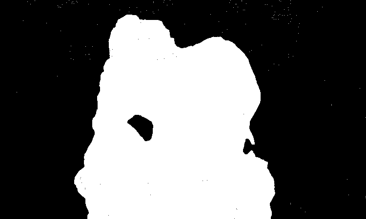
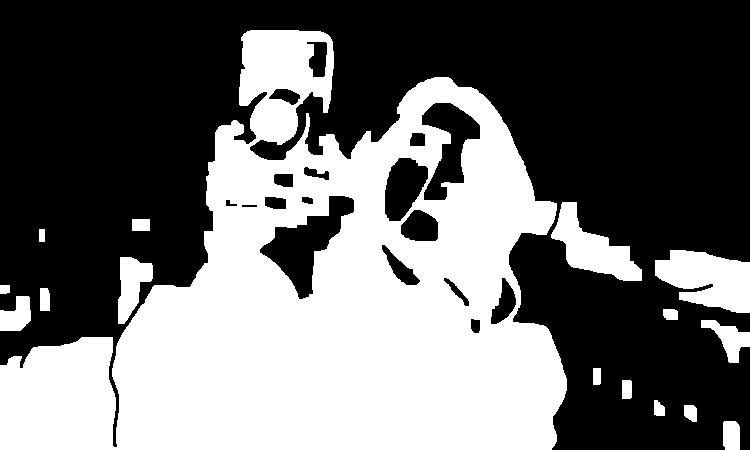
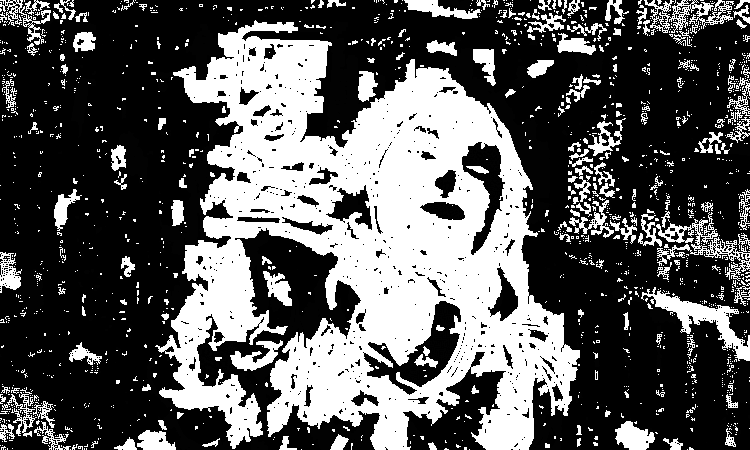
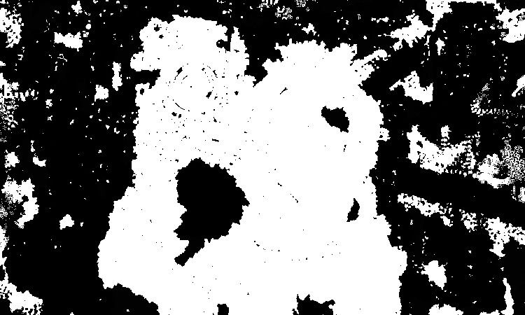
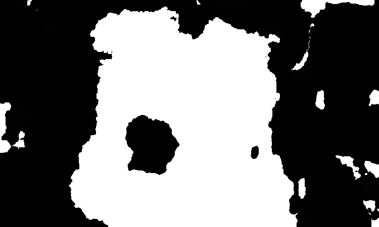

# CV_PA1

## Notes

* if you want to simply check the result images and IoUs, run test.py. it would generate images in results folder and print IoUs

  > python3 test.py

* For running graphcut.py, imcut package is required. it can be easily install using pip

  > pip install imcut

  

## Results

*  ### Least Square Solution 

  

* ### Graph-cut Solution

  

  

* ### Least Square using Laplacian, Modified Laplacian, Sum of ML

  

  

  

  

  

  

  
